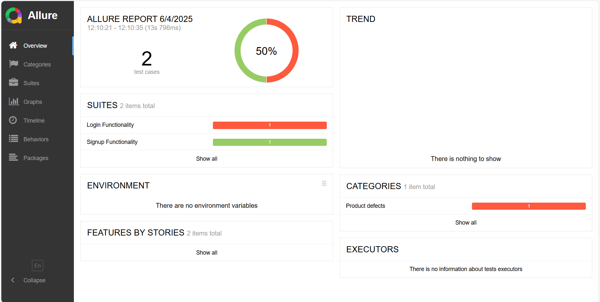

# TypeScript Cypress EnableEdge

[](https://github.com/enableedge/typescript-cypress-enableedge)
[](https://github.com/enableedge/typescript-cypress-enableedge/issues)


## Description
Cypress sample repository for UI and API automation using Cypress with TypeScript and Allure reporting.

## Getting Started

### Prerequisites
- Node.js (version 14 or higher)
- Java (version 11 or higher)

### Installation
1. Clone the repository:
```bash
git clone https://github.com/enableedge/typescript-cypress-enableedge.git
```

2. Navigate to the project directory:
```bash
cd typescript-cypress-enableedge
```

3. Install dependencies:
```bash
npm install
```

## Running the Tests

### Command Line Mode
To run the tests in command line mode and launch allure report in browser:

```bash
npm run tests
```
or 

```bash
yarn run tests
```
Reports will be generated separately for API and UI test cases but will have the same essence of Allure.



## Built With
- [Cypress](https://www.cypress.io/) - End-to-end testing framework
- [TypeScript](https://www.typescriptlang.org/) - JavaScript with syntax for types
- [Allure](https://docs.qameta.io/allure/) - Test report generator
- [Allure Cypress Plugin](https://github.com/shelex/cypress-allure-plugin) - Cypress integration for Allure reports

## License
This project is licensed under the MIT License - see the [LICENSE](LICENSE) file for details

## Contributing
Please read [CONTRIBUTING.md](CONTRIBUTING.md) for details on our code of conduct and the process for submitting pull requests.


